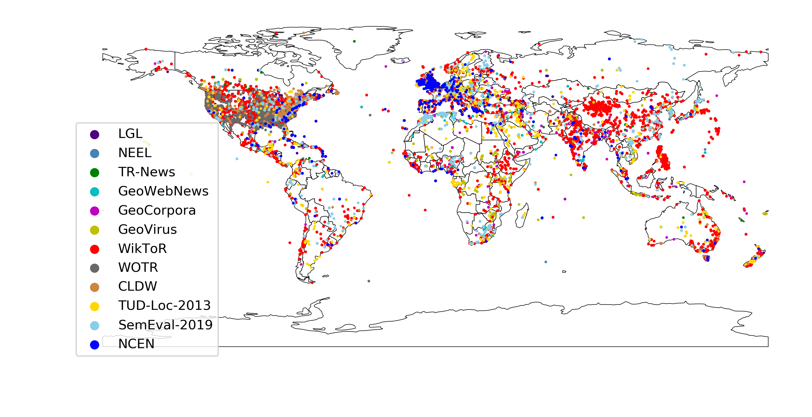

# toponym-disambiguation-voting
How can voting mechanisms improve the robustness and generalizability of toponym disambiguation?

## 1.Introduction
A voting based toponym disambiguation approach, which was compared with 20 latest and commonly-used approaches on 12 datasets, containing 98,300 toponyms across the world.

## 2. How to use the code

Use the following command to run the voting approach on one certain dataset ('lgl','neel','trnews','gwn','geocorpora','geovirus','wiktor','wotr', 'LDC', 'TUD','semeval', '19th')
> python voting.py --data geocorpora
